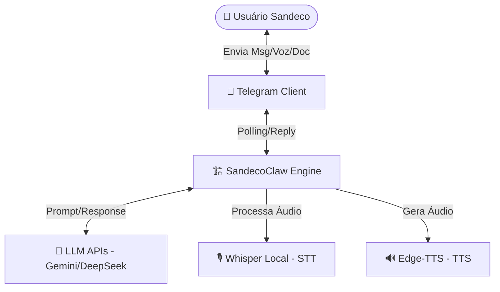
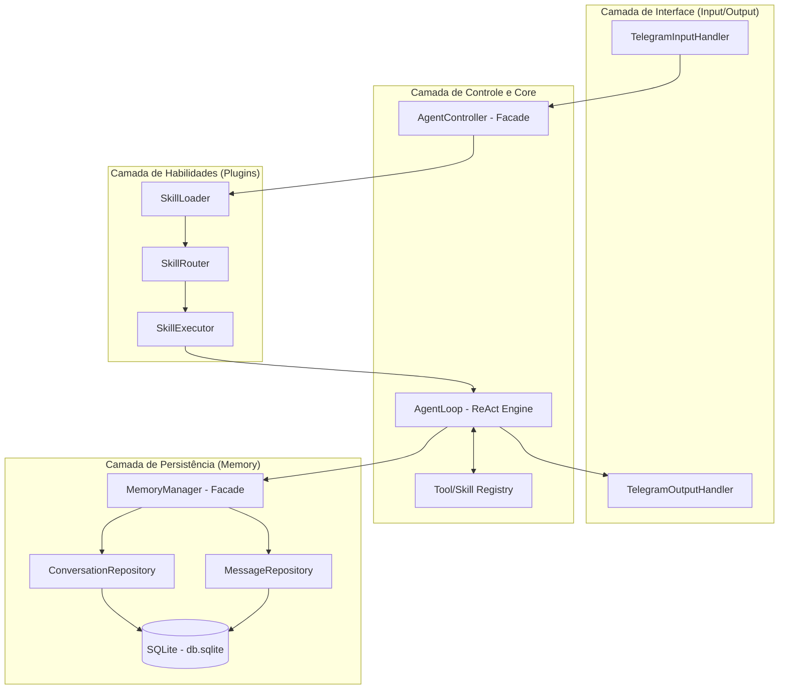
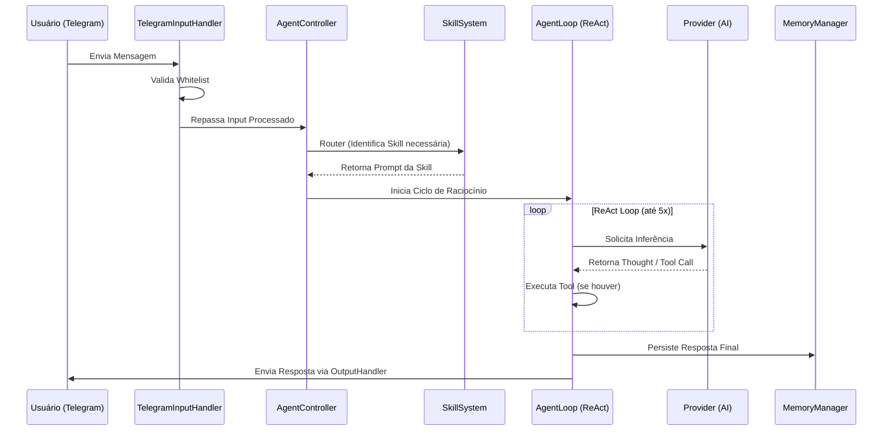

# Arquitetura do Projeto: SandecoClaw

**Versão:** 1.0  
**Status:** Definição Central de Arquitetura  
**Autor:** Antigravity (IA)  
**Data:** 2026-03-09  

---

## 2.1 Visão Geral

O **SandecoClaw** é um agente pessoal de Inteligência Artificial projetado para operar localmente no desktop do usuário. Sua interface primária de controle é o Telegram, permitindo uma interação fluida via texto, documentos e voz. O sistema é construído para ser modular, extensível através de "skills" (habilidades) e totalmente focado na privacidade, mantendo a persistência de dados localmente.

A arquitetura segue um fluxo de pipeline onde as mensagens do Telegram são capturadas, processadas por um motor de raciocínio (Agent Loop) que utiliza LLMs externos (como Gemini ou DeepSeek) apenas para inferência, e responde de volta ao usuário de forma inteligente, podendo inclusive gerar arquivos ou respostas em áudio.

---

## 2.2 Requisitos Arquiteturais

| Requisito | Tipo | Prioridade | Notas |
|-----------|------|------------|-------|
| Operação Local | Não-funcional | Crítica | O "core" deve rodar no host local (Windows). |
| Interface Telegram | Funcional | Alta | Uso da biblioteca `grammy` para polling. |
| Persistência Local | Funcional | Alta | Armazenamento de conversas em SQLite. |
| Padronização de LLMs | Não-funcional | Alta | Troca dinâmica de provedores (Gemini, DeepSeek, Groq). |
| Multimodalidade (Input) | Funcional | Média | Suporte a PDF e Voz (STT via Whisper Local). |
| Multimodalidade (Output)| Funcional | Média | Suporte a Arquivos (.md) e Voz (TTS). |
| Segurança de Acesso | Funcional | Crítica | Whitelist estrita baseada em ID de usuário do Telegram. |

---

## 2.3 Estilo Arquitetural

O sistema adota um estilo **Monolito Modular com Sistema de Plugins**.  
- **Monolito Modular:** Facilita o desenvolvimento e deploy local sem a complexidade de microsserviços.
- **Plugin-based (Skills):** Permite que novas funcionalidades sejam adicionadas ou atualizadas via "Hot-Reload" apenas manipulando diretórios na pasta `.agents/skills`, sem reiniciar o processo principal.

**Trade-offs:**  
- **Vantagem:** Baixa latência interna, facilidade de manutenção para um único desenvolvedor, alta coesão.
- **Desvantagem:** Escalabilidade vertical limitada ao hardware do host local (não é um problema para o caso de uso de agente pessoal).

---

## 2.4 Diagrama de Contexto

---

## 2.5 Diagrama de Componentes e Camadas

O projeto segue estritamente a **Programação Orientada a Objetos (POO)** com separação clara de responsabilidades em arquivos e módulos distintos.

---

## 2.6 Decisões de Tecnologia (Source of Truth)

Este tópico centraliza as definições de stack. **Alterações aqui devem refletir mudanças em toda a arquitetura do sistema.**

| Componente | Tecnologia | Detalhes / Justificativa |
|------------|------------|-------------------------|
| **Linguagem** | **Node.js (TypeScript)** | Ambiente rátido para IO, ecossistema rico e familiaridade. |
| **Paradigma** | **Orientação a Objetos** | Uso obrigatório de Classes, Interfaces e Padrões de Projeto (User Rule). |
| **Banco de Dados**| **SQLite** | Local, serverless, rápido (`better-sqlite3`). |
| **Interface Bot** | **grammy** | Framework moderno e performático para Telegram Bot API. |
| **Raciocínio IA** | **ReAct Pattern** | Loop de "Thought -> Action -> Observation -> Answer". |
| **STT (Voz)** | **Whisper (Local)** | Transcrição privada sem custo de API. |
| **TTS (Fala)** | **Edge-TTS** | Geração de voz de alta qualidade (`pt-BR-Thalita`). |
| **Parser Documentos**| **pdf-parse** | Extração de texto de PDFs para processamento pela IA. |

---

## 2.7 Desing Patterns Utilizados

Para manter a alta coesão e baixo acoplamento, os seguintes padrões são aplicados:

1.  **Facade:** Utilizado no `AgentController` e `MemoryManager` para simplificar a interface com subsistemas complexos.
2.  **Factory:** `ProviderFactory` para instanciar diferentes provedores de LLM e `ToolFactory` para as ferramentas.
3.  **Repository:** Para abstrair o acesso ao banco de dados SQLite (`ConversationRepository`, `MessageRepository`).
4.  **Singleton:** Garantir instância única da conexão com o banco de dados.
5.  **Strategy:** No `TelegramOutputHandler` para decidir entre enviar texto puro, chunks ou arquivos.
6.  **Registry:** No sistema de Skills e Tools para registro dinâmico de capacidades.

---

## 2.8 Fluxos Críticos (Sequence Diagram)

### Fluxo de Processamento de Mensagem

---

## 2.9 Infraestrutura e Deploy

- **Ambiente:** Execução direta no Windows via Terminal.
- **Process Management:** `npm run dev` (utilizando nodemon para hot-reload do core).
- **Diretórios de Dados:**
    - `./data/`: Banco de dados SQLite (`.db`).
    - `./tmp/`: Arquivos temporários (PDFs/Áudios) deletados após uso.
    - `.agents/skills/`: Plugins de habilidades em Markdown.

---

## 2.10 Riscos e Mitigações

| Risco | Impacto | Mitigação |
|-------|---------|-----------|
| Corrupção do SQLite | Alto | Uso de WAL (Write-Ahead Logging) e backups locais periódicos. |
| Falha na API de LLM | Alto | Implementação de `fallback` no `ProviderFactory`. |
| Vazamento de Memória (Node) | Médio | Gerenciamento estrito de Buffer de áudio e exclusão de arquivos TMP. |
| Estouro de Contexto IA | Médio | Truncamento nativo no `MemoryManager` via `MEMORY_WINDOW_SIZE`. |

---

## Gaps de Documentação (Observações)

Os seguintes elementos foram inferidos ou precisam de definição futura conforme o amadurecimento do código:

| Elemento | Status | Recomendação |
|----------|--------|--------------|
| Migrations de BD | Não documentado | No futuro, implementar scripts de migration para evoluir o esquema SQL sem perda de dados. |
| Rate Limiting Telegram | Inferido | Manter a lógica de `sleep` no OutputHandler caso a API retorne erro 429. |
| Versão do Node.js | Inferido | Recomenda-se LTS (v20+) para estabilidade das bibliotecas nativas de FS. |
